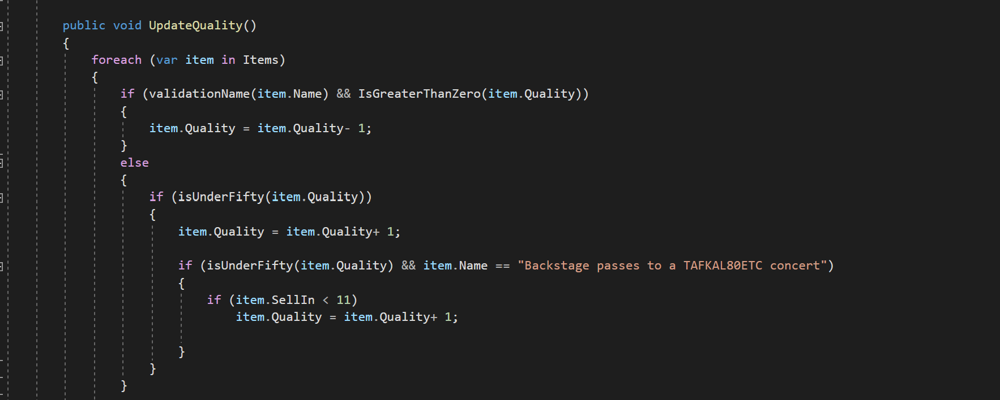
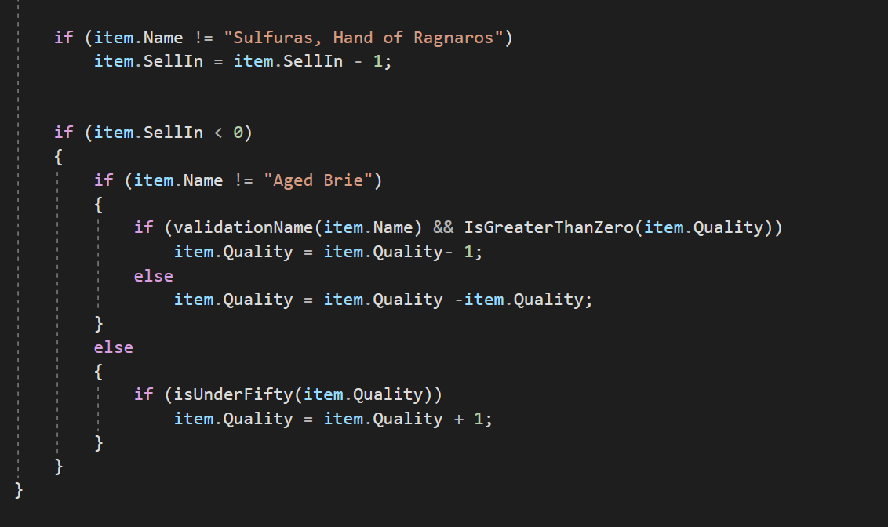
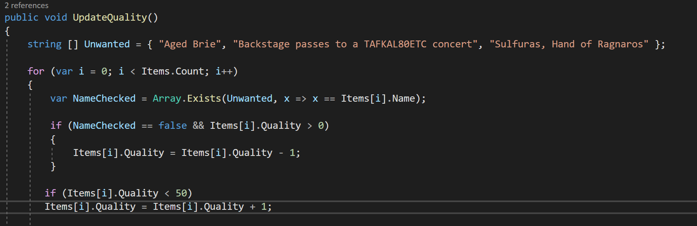
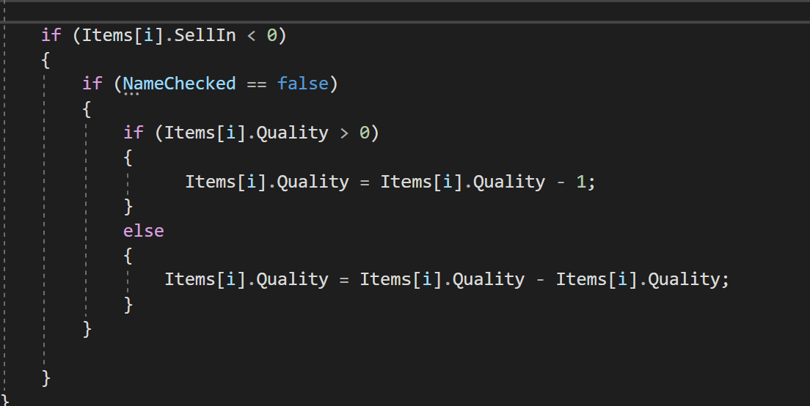
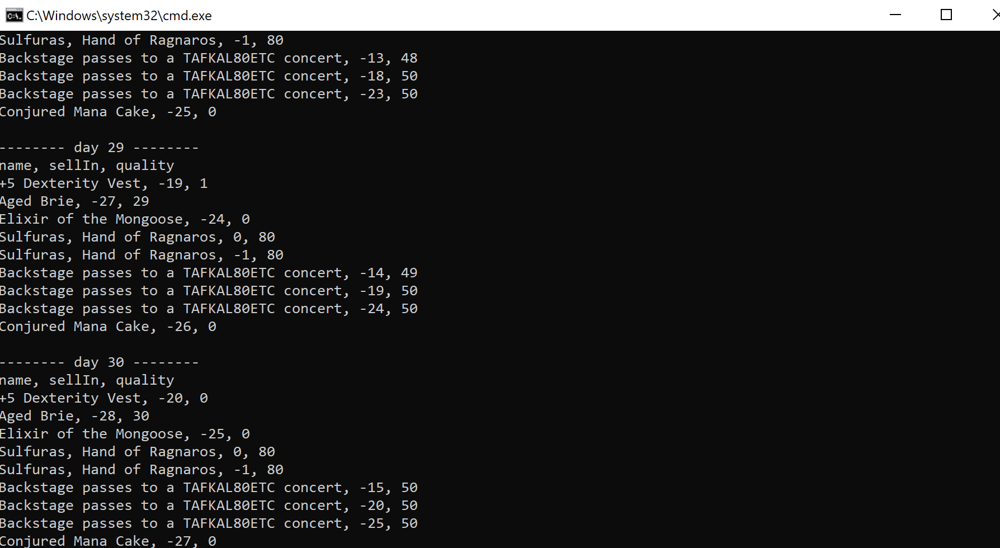

----

 

# Challenge 01

## Code Smell:

### 1- 

### 2- 

Definition: 

- Duplicated Code and Logic: 
Duplicated code is considered one of the worse code smells. Beyond blatant copy paste, there are subtle duplications like parallel inheritance hierarchies and repetitive code structures.
Why it’s bad? Makes code more difficult to maintain.
- Long Method:
Long code components take time to read and fully understand. Why it’s bad? Hurts code readability and reusability.

## Solution:

Delete unnecessary if statement and aggregate all items' names in an array, and compare just one time.

### 1- 

### 2- 

## Output:

Author:
Samirah Alhusayni

**recourse**: 
- https://github.com/NotMyself/GildedRose
- http://iamnotmyself.com/2011/02/14/refactor-this-the-gilded-rose-kata/

> please make sure you fork this repo and submit your code as PR.🦾
